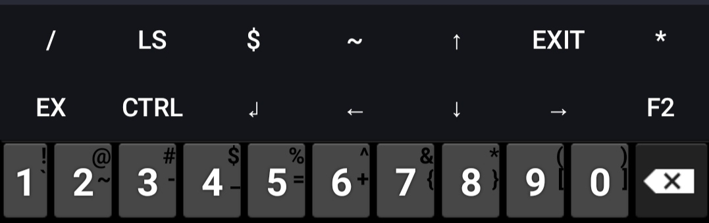
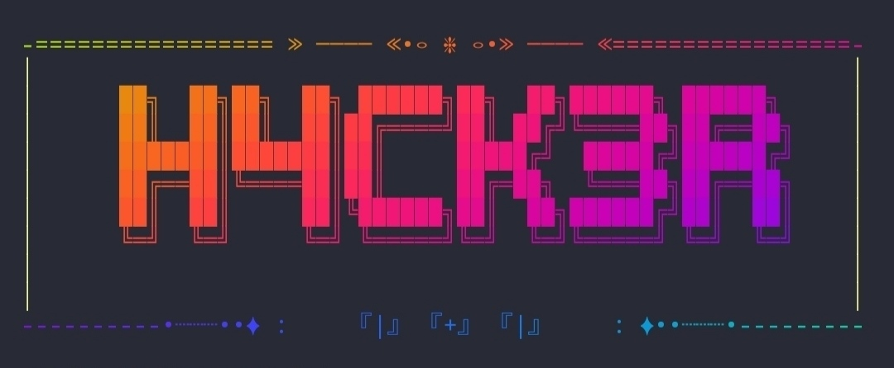
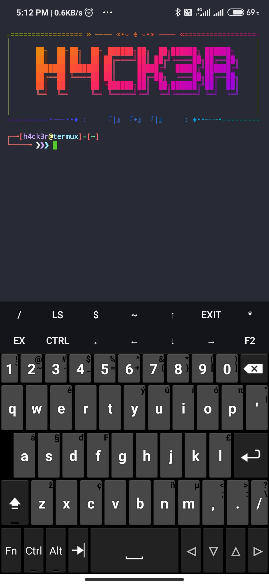

# Termux-os

Based on Zsh Shell

Pure Termux Look

Credits to Oh My Zsh

# Features

Added Termux Extra Keys

  

Added Banner 

  

Added Own made Advance zsh theme

  

Added Highlight / Autosuggestion

  

# Photos Of Theme

  

# Installation

git clone https://github.com/h4ck3r0/Termux-os

cd Termux-os

bash os.sh
