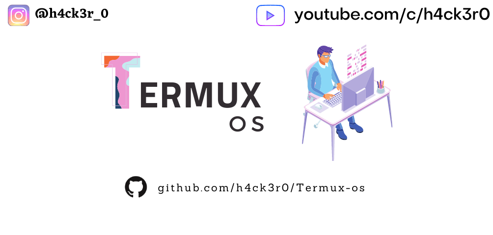
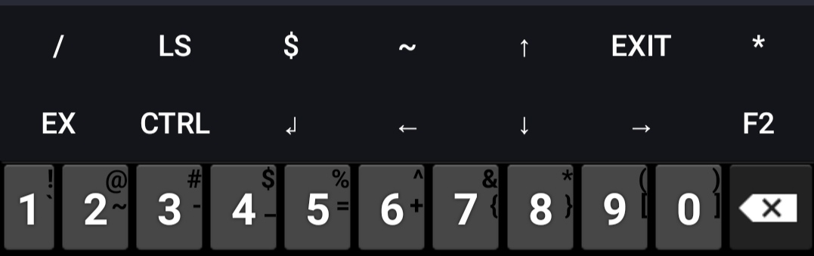
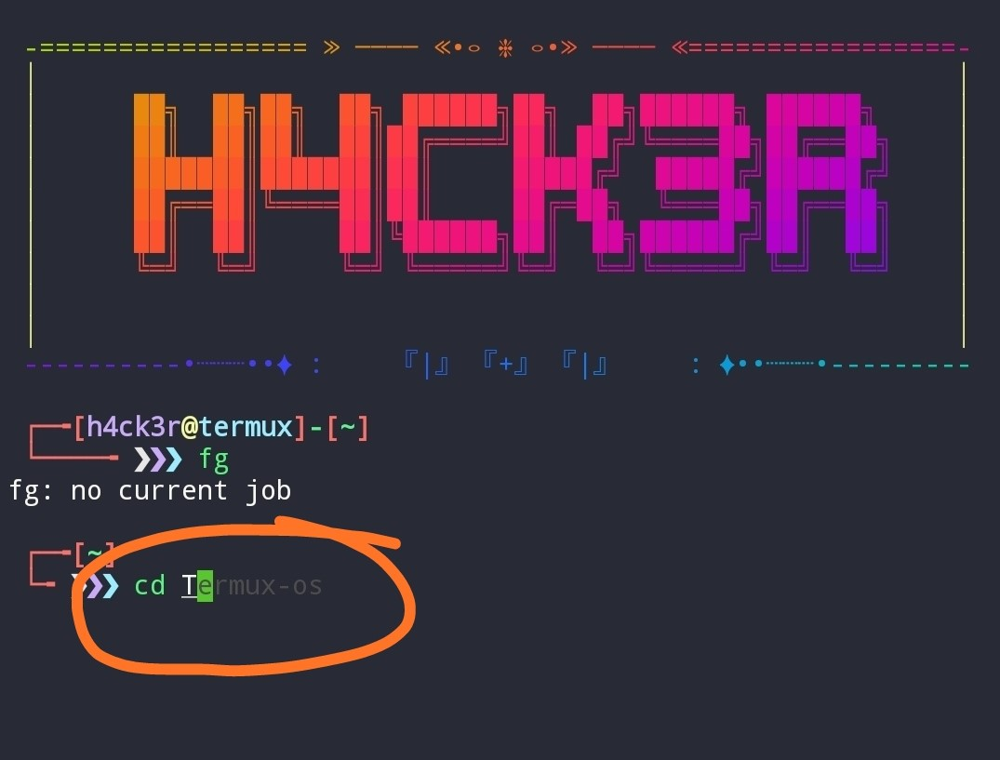
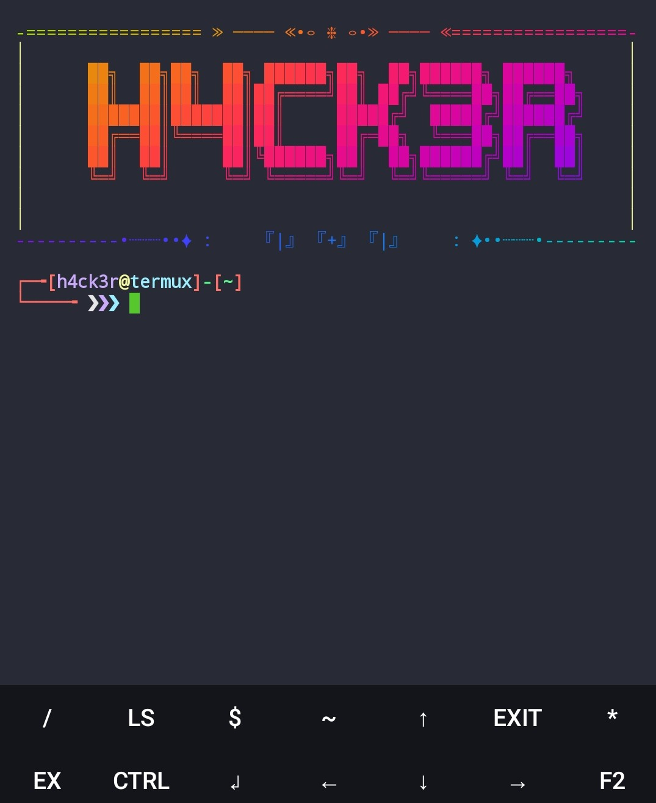

 

# Termux-os

Based on Zsh Shell

Pure Termux Look

Credits to Oh My Zsh

# Features

`Added Termux Extra Keys`

  

`Added Banner`

  

`Added Own made Advance zsh theme`

  

`Added Highlight / Autosuggestion`

  

# Photos Of Theme

  

# Installation

`git clone https://github.com/h4ck3r0/Termux-os`

`cd Termux-os`

`bash os.sh`

## CONNECT WITH US :

